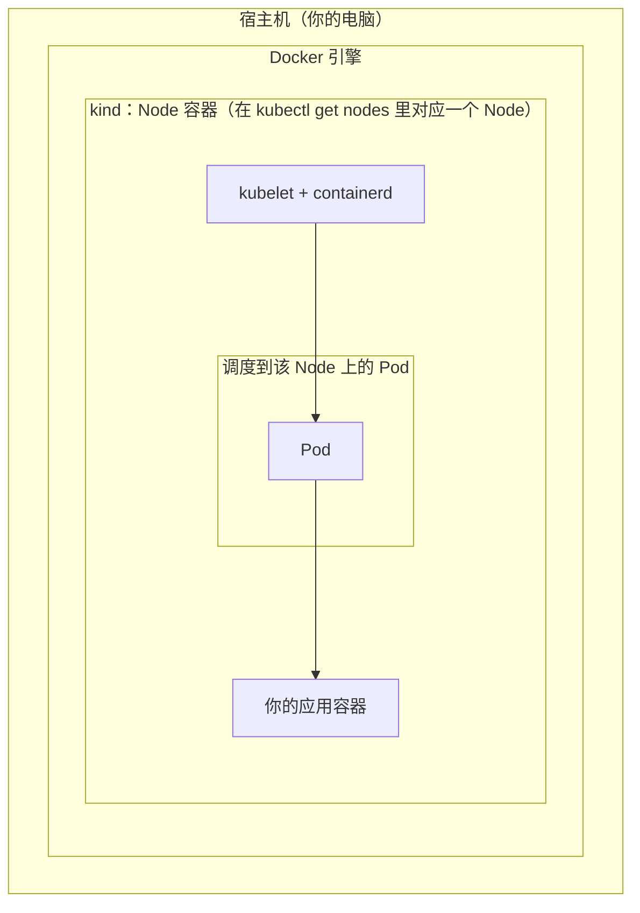

# 第 0 章 环境与工具

面向：本地 **kind** 或 **minikube** + 本仓库示例。每节末尾有练习题。

**上一章**：无｜**下一章**：[第 1 章 Gin 微服务](./chapter-01.md)

---

### 0.1 你需要什么

- **Go**：1.22+（与 `learn-api/go.mod` 一致）
- **Docker**：构建与运行镜像
- **kubectl**：操作集群
- **本地集群**：**kind** 或 **minikube** 二选一
- 可选：`helm`、`kustomize`、压测工具 **hey** 或 **wrk**

**要点**：本教程不绑定云厂商；后面 CI/CD、CA 等云相关小节可纸面完成。

**练习 0.1**：安装后执行 `kubectl version --client`、`docker version`，均能正常输出。

---

### 0.2 起一个本地集群

先确认 **Docker 已启动**（桌面版或 `docker info` 无报错），否则 kind 无法创建节点容器。

**kind 示例：**

```bash
kind create cluster --name learn
kubectl config use-context kind-learn   # 若集群名不是 learn，见下文说明
```

**命令说明（中文）：**

| 命令 | 作用 |
|------|------|
| `kind create cluster` | 在本机 Docker 里拉起一个 Kubernetes 集群（会下载镜像、创建控制面与工作节点容器，首次可能较慢）。 |
| `--name learn` | 给集群起名叫 `learn`，便于本机存在多个 kind 集群时区分；不写 `--name` 时默认集群名多为 `kind`，对应上下文一般为 `kind-kind`。 |
| `kubectl config use-context kind-learn` | 告诉本机的 **kubectl**：以后默认连哪一个集群。**上下文（context）** 里包含集群地址、证书、默认命名空间等；`kind` 创建的集群，上下文名一般为 **`kind-` + 你起的集群名**，这里即 `kind-learn`。 |

**若不确定上下文名**：建完集群后执行 `kubectl config get-contexts`，在列表里找 `*` 当前或未选中的那一行，名称一般是 `kind-<集群名>`，再执行 `kubectl config use-context <该名称>`。若你只建过一个 kind 集群，kind 往往会自动把它设为当前上下文，此时**可能不必**手动 `use-context`，但显式执行一次可以避免连错集群。

**minikube 示例：**

若上文已用 **kind** 建好并正在使用集群，**不必**再执行下面命令——**minikube 与 kind 都是「在本机起一个 Kubernetes」的工具，作用类似，教程里二选一即可**；同时装两套会多占资源，除非你刻意对比体验。

```bash
minikube start
```

**要点**：一个上下文对应一个集群；多集群时注意 `kubectl config current-context`。

**练习 0.2**：`kubectl get nodes` 中节点状态为 `Ready`。

---

### 图示：kind 下的 Pod、Node 与宿主机

在 **Kubernetes 的抽象**里：工作负载以 **Pod** 形式存在，Pod 被调度到 **Node** 上，Node 里用容器运行时（如 containerd）真正拉起容器。

用 **kind** 时，这些 Node 并不是虚拟机，而是 **宿主机 Docker 里的「节点」容器**；你的 Pod 仍由 kubelet 调度到某个 Node 上，只是该 Node 在物理上对应一个 Docker 容器。单节点集群时，通常只有一个这样的 Node 容器承载你的 Pod。



说明：你在宿主机用 **kubectl** 时，请求先到集群里的 **API Server**（一般在控制面容器内），再由控制面调度/下发到各 Node 的 kubelet；上图只画 **物理层次**（Docker → Node 容器 → Pod → 容器）。

**对照记忆**：

| 概念 | 含义 |
|------|------|
| **kind** | 在本机用 Docker **创建/管理** 集群的工具，不是集群里的「一层资源」。 |
| **Node** | 集群里负责跑 Pod 的节点；在 kind 里常对应 **一个 Docker 容器**（`docker ps` 可见）。 |
| **Pod** | 调度与部署的最小单位，内含一个或多个**容器**（同一 Pod 内容器共享网络与部分存储）。 |

minikube 也会给你「一个本地集群」，但 Node 的实现方式与 kind 不同；**Pod → Node → 容器** 这层关系在概念上不变。

---

### 0.3 命名约定

**命名空间（Namespace）是做什么的**：在同一个集群里，再划出一层 **逻辑边界**。多数名字（Deployment、Service、ConfigMap 等）**只在某个命名空间内唯一**，不同命名空间可以同名资源互不冲突。它还常作为 **权限（RBAC）、资源配额（ResourceQuota）、网络策略** 等作用范围，便于按团队或环境（如 `dev` / `prod`）分租。**默认**命名空间是 `default`；系统组件多在 `kube-system` 等空间里。本教程把示例都放在 **`demo`**，与生产/系统空间分开，避免误操作。

- **命名空间**：下文默认 `demo`（与 `deploy/k8s/demo/namespace.yaml` 一致）
- **镜像标签**：生产常用 **git commit 短 SHA**；本地可用 `local`

**练习 0.3**：执行 `kubectl apply -f deploy/k8s/demo/namespace.yaml`，或 `kubectl create namespace demo`，后续命令统一加 `-n demo`（表示操作对象是 **`demo` 命名空间里的资源**）。
